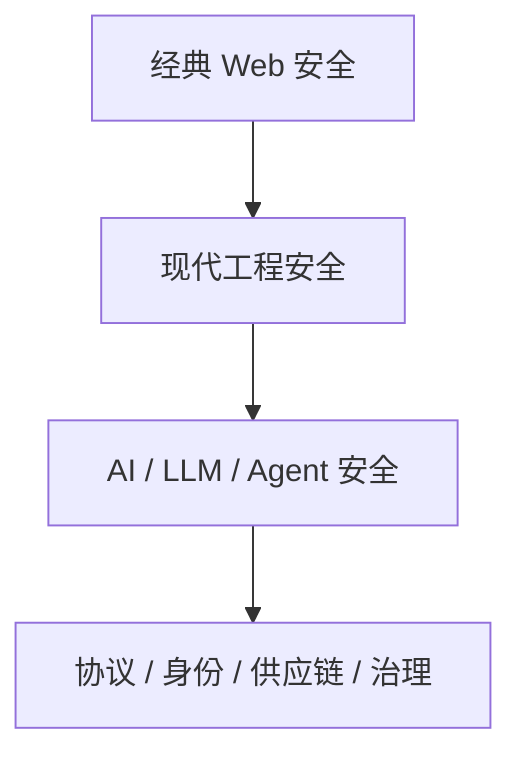
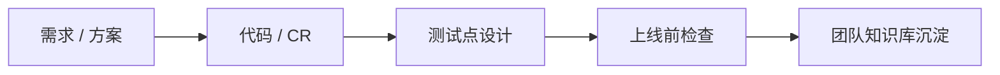

---
layout: cover
class: dark-panel
---

  

    Team Security Sharing
    <h1 class="mt-6 !text-5xl !leading-tight !font-700 max-w-4xl">
      OWASP 安全编码规范
       
      与 AI 时代的安全落地
    </h1>
    

      从传统 Web 安全底线，走到 Top 10:2025、Agent / MCP / Skill 风险，
      再走到团队里真正可试点的 AI 安全能力。
    

  

  

    

      
受众

      
前端 / 后端 / 运维平台

    

    

      
技术栈

      
Java + Spring Boot + MySQL

    

    

      
主线

      
规范 -> 风险 -> AI -> 落地

    

  

<!--
开场先把边界讲清楚：这不是漏洞百科，而是团队研发动作怎么更安全。
-->

---
layout: statement
class: dark-panel
---

# 安全分享最怕的，不是大家没听过名词

## 而是大家知道风险，却没有把它变成默认动作

---
layout: two-cols-header
---

# 今天这 1 小时，我们想解决什么

::left::

  
希望带走的东西

  <h3 class="mt-2 !text-2xl">不是更多术语，而是更稳定的默认动作</h3>
  <v-clicks class="mt-5">

  - 写接口时想到输入校验、权限校验、异常处理、日志审计
  - 写页面时想到输出编码、富文本风险、文件上传风险
  - 做部署时想到默认配置、暴露面、凭据、补丁
  - 用 AI 时想到 prompt、tool、token、skill、供应链

  </v-clicks>

::right::

  
分享主线

  

    

      
1

      
从 <code>OWASP_zh.pdf</code> 看安全编码底线

    

    

      
2

      
用 <code>OWASP Top 10:2025</code> 对齐现代高频风险

    

    

      
3

      
看看 AI 时代，OWASP 已经变成了什么样

    

    

      
4

      
讨论怎样把 OWASP 嵌进团队日常流程和 AI 助手里

    

  

---
layout: section
class: dark-panel
---

# 第一部分

## `OWASP_zh.pdf` 依然值得讲，因为它提供的是底线

---
layout: two-cols
---

# 为什么这份中文 PDF 今天仍然有价值

  
它不是某个框架教程

  

    它更像一份跨技术栈的底线规则集：
    输入、输出、认证、会话、授权、日志、配置、数据库、文件上传……
  

  

    不管技术怎么变，Web 开发总有一些必须反复做到的安全常识。
  

::right::

  

    
输入

    
所有输入都不可信

  

  

    
输出

    
所有输出都要按上下文编码

  

  

    
权限

    
认证、会话、授权必须在服务端收口

  

  

    
交付

    
日志、配置、数据库、文件都属于安全边界

  

---
layout: two-cols-header
---

# 四个总原则

::left::

<v-clicks>

- **不要把客户端限制当成安全控制**
  前端校验、隐藏字段、按钮灰掉只能改善体验
- **安全控制要集中化、服务端化、可复用**
  不要把安全逻辑散在每个 Controller 里

</v-clicks>

::right::

<v-clicks>

- **默认拒绝，而不是默认放行**
  特别是权限、配置、异常处理和文件访问
- **安全问题通常是“链路没收口”**
  页面、服务端、数据库、日志、部署必须一起看

</v-clicks>

---
layout: fact
---

# 今天第一部分，我只建议团队牢牢记住六个主题

## 输入验证 / 输出编码 / 认证与会话 / 访问控制 / 错误与日志 / 配置数据库文件

---
layout: two-cols-header
---

# 输入验证：所有输入都不可信

::left::

  “在可信系统（比如：服务器）上执行所有的数据验证。”
    
  “尽可能采用‘白名单’形式，验证所有的输入。”
    
  “在处理以前，验证所有来自客户端的数据……”

::right::

  
对团队最重要的提醒

  <v-clicks class="mt-3">

  - 输入不只是表单字段，还包括 URL、JSON、Header、Cookie、MQ、回调、上传文件名
  - 校验不只是“非空”，还要覆盖类型、长度、范围、枚举值、业务合法性
  - 数据库和缓存里再次读出来的数据，也可能是不可信的

  </v-clicks>

---
layout: two-cols
---

# 输入验证：最常见的三类事故

  
真实高频场景

  <v-clicks class="mt-3">

  - 接口只校验非空，不校验状态流转是否合法
  - 排序字段、表名动态传入，最后拼进 SQL
  - 文件下载接口接受路径参数，出现路径穿越

  </v-clicks>

::right::

  
落地动作

  <v-clicks class="mt-3">

  - DTO 层做注解校验，业务层做规则校验
  - 排序字段、状态流转、模板名、对象 key 全部白名单化
  - 统一拦截器 / 网关 / 公共组件承接可复用规则

  </v-clicks>

---
layout: two-cols-header
---

# 输出编码：不是“过滤脏字符”，而是“按上下文编码”

::left::

  “通过语义输出编码方式，对所有返回到客户端的来自于应用程序信任边界之外的数据进行编码。”

  
关键认知

  

    同一份用户输入，落在 HTML 文本、HTML 属性、JS 片段、URL、响应头里，
    需要的处理方式都不一样。
  

::right::

  

    
常见误区

    <ul class="mt-3 tiny leading-7">
      <li v-click>以为统一替换 <code>&lt;</code> 和 <code>&gt;</code> 就够了</li>
      <li v-click>以为 React / Vue 默认转义就能覆盖所有 XSS 场景</li>
      <li v-click>忘记 <code>v-html</code>、富文本、Markdown、下载文件名回显</li>
    </ul>
  

  

    
落地动作

    <ul class="mt-3 tiny leading-7">
      <li v-click>前端默认使用安全渲染能力，少做原始 HTML 注入</li>
      <li v-click>富文本统一做白名单清洗</li>
      <li v-click>后端输出到不同上下文前，选择对应编码策略</li>
    </ul>
  

---
layout: two-cols
---

# 认证与会话：别把“登录成功”当成安全终点

  “对所有的网页和资源要求身份验证。”
    
  “身份验证的失败提示信息应当避免过于明确。”
    
  “注销功能应当完全终止相关的会话或连接。”

::right::

  
要按整条链路设计

  <v-clicks class="mt-3">

  - 密码怎么存，是否抗弱密码和撞库
  - 是否有频控、锁定、MFA、风险登录控制
  - Token 生命周期多长，能不能撤销
  - 登出后是否真的失效，切换账号后旧会话是否还有效

  </v-clicks>

---
layout: two-cols-header
---

# 访问控制：最容易真的出事故的一章

::left::

  “只使用可信系统对象……以做出访问授权的决定。”
    
  “在每个请求中加强授权控制……”
    
  “限制只有授权的用户才能访问直接对象引用。”

::right::

  
常见错误

  <v-clicks class="mt-3 tiny">

  - 只做登录校验，没有做授权校验
  - 只做页面权限，没有做接口权限
  - 只做功能权限，没有做数据权限
  - 改一下 <code>orderId</code> / <code>userId</code> 就能看别人的数据

  </v-clicks>

  
记忆句

  

    权限控制至少要回答三个问题：你是谁、你能做什么、这份数据是不是你的。
  

---
layout: two-cols
---

# 错误处理与日志：对外要收敛，对内要完整

  “不要在错误响应中泄露敏感信息……”
    
  “日志记录控制应当支持记录特定安全事件的成功或者失败操作。”

::right::

  

    
常见问题

    <ul class="mt-3 tiny leading-7">
      <li v-click>堆栈信息直接返回前端</li>
      <li v-click>日志打出 token、手机号、身份证、请求体</li>
      <li v-click>登录失败和权限失败没有审计</li>
    </ul>
  

  

    
平衡点

    <ul class="mt-3 tiny leading-7">
      <li v-click>对外：错误信息尽量抽象</li>
      <li v-click>对内：关键安全事件必须可追踪、可告警、可复盘</li>
      <li v-click>日志里不能再制造新的泄露</li>
    </ul>
  

---
layout: two-cols-header
---

# 配置、数据库与文件上传：很多事故不在业务代码里

::left::

  “确保服务器、框架和系统部件安装了当前使用版本的所有补丁。”
    
  “使用强类型的参数化查询方法。”
    
  “只验证文件类型扩展是不够的。”

::right::

  
团队高频落点

  <v-clicks class="mt-3 tiny">

  - Actuator、Swagger、测试端点在生产暴露
  - 数据库账号权限过大，MyBatis <code>${}</code> 动态拼接
  - 上传目录可执行，对象存储桶默认公开
  - 只看扩展名，不看文件头

  </v-clicks>

---
layout: statement
class: dark-panel
---

# 第一部分只收束成一句

## 安全不是上线前扫一次，而是需求到部署全过程都要守住默认底线

---
layout: section
class: dark-panel
---

# 第二部分

## `OWASP Top 10:2025` 告诉我们，现代风险已经不只在代码里

---
layout: two-cols-header
---

# Top 10:2025 总览

::left::

  
官方排名

  <ol class="mt-3 text-[0.95rem] leading-7">
    <li>A01 Broken Access Control</li>
    <li>A02 Security Misconfiguration</li>
    <li>A03 Software Supply Chain Failures</li>
    <li>A04 Cryptographic Failures</li>
    <li>A05 Injection</li>
    <li>A06 Insecure Design</li>
    <li>A07 Authentication Failures</li>
    <li>A08 Software or Data Integrity Failures</li>
    <li>A09 Security Logging &amp; Alerting Failures</li>
    <li>A10 Mishandling of Exceptional Conditions</li>
  </ol>

::right::

  
2025 版最值得注意的三点

  <v-clicks class="mt-4">

  - **配置错误** 升到第 2 位：暴露面和默认配置问题非常现实
  - **软件供应链** 升到第 3 位：安全边界早就不只在业务代码里
  - **异常条件处理不当** 进入 Top 10：失败路径正式成为攻击面

  </v-clicks>

---
layout: two-cols
---

# 我建议重点讲的六项

  
A01
Broken Access Control

  
A02
Security Misconfiguration

  
A03
Software Supply Chain Failures

  
A05
Injection

  
A06
Insecure Design

  
A10
Mishandling of Exceptional Conditions

::right::

  
为什么这样取舍

  <v-clicks class="mt-3 tiny">

  - A01：我们最容易真的出事故
  - A02 / A03：现代工程现实最强
  - A05：最经典，也最容易被误判“已经解决”
  - A06：把安全前移到设计阶段
  - A10：2025 新信号，失败路径也是攻击面

  </v-clicks>

---
layout: two-cols-header
---

# A01 Broken Access Control

::left::

  
核心问题

  

    用户能不能访问不属于自己的资源，
    或执行本不该执行的操作。
  

  
典型事故

  

    改 ID 看别人数据、接口漏权限、导出越权、多租户隔离只做在页面上。
  

::right::

  
治理抓手

  <v-clicks class="mt-3">

  - 统一身份、统一授权模型
  - 关键对象的 ownership 校验
  - 接口层和数据层都要控权
  - 增加越权专项测试

  </v-clicks>

  

    越权问题本质上是：业务边界没有被系统真正执行。
  

---
layout: two-cols-header
---

# A02 Security Misconfiguration

::left::

  
今天为什么这么靠前

  <v-clicks class="mt-3 tiny">

  - 默认配置没关
  - 端点、页面、服务暴露过多
  - 错误页暴露细节
  - 安全头缺失
  - 对象存储、容器、网关没有做收口

  </v-clicks>

::right::

  
对团队的现实要求

  <v-clicks class="mt-3 tiny">

  - 基线模板化
  - 暴露面盘点
  - 自动检查而不是人工记忆
  - 上线前配置核查

  </v-clicks>

  

    这类问题通常不是“谁写错了一行代码”，
    而是整个交付链路缺少统一安全基线。
  

---
layout: two-cols-header
---

# A03 Software Supply Chain Failures

::left::

  
今天的供应链不只等于依赖版本

  <v-clicks class="mt-3 tiny">

  - Maven 依赖和传递依赖
  - 镜像来源与制品仓库
  - CI/CD 权限与发布流程
  - 插件、脚本、自动化工具

  </v-clicks>

::right::

  
团队现实动作

  <v-clicks class="mt-3 tiny">

  - 做依赖和镜像清单
  - 关注高危漏洞公告
  - 构建产物可追溯
  - 关键仓库和流水线做最小权限与 MFA
  - 逐步引入 SBOM、签名和来源证明

  </v-clicks>

  

    哪怕业务代码写得很好，交付链路被污染，结果仍然可能是不安全的。
  

---
layout: two-cols
---

# A05 Injection

  
不只是 SQL 注入

  <v-clicks class="mt-3 tiny">

  - SQL / HQL / JPQL 注入
  - 命令注入
  - 表达式注入
  - 模板注入
  - 未来 LLM 场景下的 Prompt Injection

  </v-clicks>

::right::

  
记忆方式

  

    注入的本质，是把 <b>不可信输入</b> 当成了
    <b>程序指令的一部分</b>。
  

  <v-clicks class="mt-4 tiny">

  - 能结构化传参就不要字符串拼接
  - 能不用解释器式接口就不用
  - 必要时对白名单控制可变部分
  - 审计 MyBatis <code>${}</code>、shell、模板、表达式引擎

  </v-clicks>

---
layout: two-cols-header
---

# A06 Insecure Design + A10 Exceptional Conditions

::left::

  
A06 不安全设计

  

    很多严重问题不是因为代码写错，而是因为设计阶段根本没把攻击者放进场景里。
  

  
例子

  

    弱密码找回、审批绕过、多租户隔离先天薄弱、抢购和领券没有防滥用设计。
  

::right::

  
A10 异常条件处理不当

  

    失败路径本身就是攻击面。参数缺失、超时、回退、空值、降级、并发竞争都可能绕开安全控制。
  

  
记忆句

  

    关键安全能力在异常情况下必须 fail-secure，而不是 fail-open。
  

---
layout: two-cols
---

# 其余四项，用短讲方式带过

  
<b>A04</b> 算法、密钥、传输链路和用错场景

  
<b>A07</b> 弱密码、撞库、找回密码、MFA、token 生命周期

  
<b>A08</b> 来源和完整性验证不足，信任了不该信任的制品或数据

  
<b>A09</b> 安全事件没有被记录、发现和告警

::right::

  
第二部分真正想传达的三层变化

  <v-clicks class="mt-3">

  - 经典风险仍在，尤其是越权、注入、认证
  - 工程化风险越来越重要，尤其是配置、供应链、完整性、日志
  - 失败路径已经正式成为攻击面，异常处理不能再只当稳定性问题看

  </v-clicks>

---
layout: section
class: dark-panel
---

# 第三部分

## AI 时代，OWASP 已经不只是“经典 Web Top 10”

---
layout: two-cols-header
---

# OWASP 的扩张方向

::left::

::right::

  
我们看到的变化

  <v-clicks class="mt-3 tiny">

  - 从 Web 应用扩展到 LLM、Agent、MCP、Skill
  - 从编码缺陷扩展到协议、身份、供应链、治理
  - 从文档清单扩展到标准化、事件响应、实战资源

  </v-clicks>

---
layout: two-cols
---

# 变化一：LLM Top 10 升级为 GenAI Security Project

  
这意味着什么

  

    OWASP 不再把 AI 安全理解成“给 LLM 列 10 条风险”。
    它已经开始建设一整套持续治理体系。
  

::right::

  
对团队的启发

  <v-clicks class="mt-3 tiny">

  - 只要项目接入 LLM，就已经进入新的安全面
  - 问答、RAG、代码助手、文档处理、Agent 都算
  - 以后关注的不只是“幻觉”，还包括输入面、输出面、权限面和成本面

  </v-clicks>

---
layout: two-cols-header
---

# 变化二：MCP、Skill、NHI 是新一代高相关名词

::left::

  

    
MCP Top 10

    
看 AI 系统怎样连接工具和外部系统

  

  

    
Agentic Skills Top 10

    
看 AI 被“教会怎么做事”的技能模板本身

  

  

    
Non-Human Identities Top 10

    
看不是人、但权限很大的 token / service account / robot

  

::right::

  
为什么这和我们团队强相关

  <v-clicks class="mt-3 tiny">

  - AI 助手会持有 token、文件权限、工具调用能力
  - skill 像“可执行流程模板”，会变成新的供应链和执行面
  - 非人身份会越来越多，且权限常常比普通用户更大

  </v-clicks>

---
layout: statement
---

# AI 时代的 OWASP，正在同时覆盖

## 开发 / 平台 / 安全治理 / 标准对齐

---
layout: section
class: dark-panel
---

# 第四部分

## 让 AI 增强 OWASP 在项目中的参与度和使用便捷性

---
layout: two-cols
---

# 最值得做的，不是“让 AI 负责安全”

  
而是让 AI 做两件事

  <v-clicks class="mt-3">

  - 把安全能力前移
  - 把安全规范嵌入日常研发动作

  </v-clicks>

  

    需求评审、方案评审、代码评审、测试点设计、上线检查，
    才是最适合让 AI 帮忙的地方。
  

::right::

  
核心判断

  

    最值得做的不是再写一份规范，
    而是让 OWASP 通过 AI 和工程化能力，
    进入团队每天都在重复的动作。
  

---
layout: two-cols-header
---

# `OWASP agent skill` 可以长什么样

::left::

  
四种工作模式

  <v-clicks class="mt-3 tiny">

  - 需求评审模式：看越权、认证、数据保护、审计缺口
  - 方案评审模式：看不安全设计、信任边界、权限模型
  - 代码评审模式：看注入、日志泄露、文件上传、配置错误
  - 上线检查模式：看默认配置、暴露端点、弱凭据、缺日志

  </v-clicks>

::right::

  
建议的统一输出

  <v-clicks class="mt-3 tiny">

  - 命中的 OWASP 类别
  - 风险原因与可能攻击方式
  - 修复建议
  - 推荐测试点
  - 严重级别
  - 是否需要人工复核

  </v-clicks>

---
layout: two-cols-header
---

# 一个更完整的 AI 落地组合

::left::

  

    
快速试点

    
方案评审助手 / 代码审查助手 / 安全问答 Copilot

  

  

    
工程化增强

    
测试点生成助手 / 上线前基线检查助手

  

  

    
长期建设

    
OWASP 知识库 / 模板库 / skill 生态化

  

::right::

---
layout: two-cols
---

# 最小可行试点建议

  
第一版先覆盖 8 到 12 条高频规则

  <v-clicks class="mt-3 tiny">

  - 越权
  - SQL 注入
  - XSS / 输出编码
  - 文件上传
  - JWT 生命周期
  - 敏感信息日志
  - 密钥硬编码
  - 默认配置暴露
  - 异常 fail-open

  </v-clicks>

::right::

  
试点方式

  <v-clicks class="mt-3 tiny">

  - 选一个典型业务模块
  - 把 skill 输出和现有 code review 结果做对比
  - 把效果好的规则沉淀成团队自己的规范和模板

  </v-clicks>

  

    AI 输出最终要反哺制度资产，而不是只停留在一次对话里。
  

---
layout: two-cols-header
---

# 今天最值得带走的四句话

::left::

  
1. <code>OWASP_zh.pdf</code> 提供的是今天仍然有效的安全底线。

  
2. <code>Top 10:2025</code> 告诉我们，现代风险已经扩展到配置、供应链、异常处理和完整性。

  
3. AI 时代的 OWASP 已覆盖 LLM、Agent、MCP、Skill、非人身份和治理体系。

  
4. 最值得做的是把 OWASP 通过 AI 和工程化能力嵌进日常研发流程。

::right::

  
结束句

  

    如果规范永远躺在文档里，
    它只能靠记忆执行；
      
    如果规范进入评审、进入代码、
    进入流水线、进入 agent，
    它才开始真正改变项目。
  

---
layout: end
class: dark-panel
---

# Thanks

## Q & A

  可以从三个方向继续聊：

  

    团队里最容易出现的越权和配置问题
  

  

    如果要试点一个 OWASP agent skill，第一版怎么做
  

  

    哪些 AI 安全风险最值得提前纳入项目规范
  

